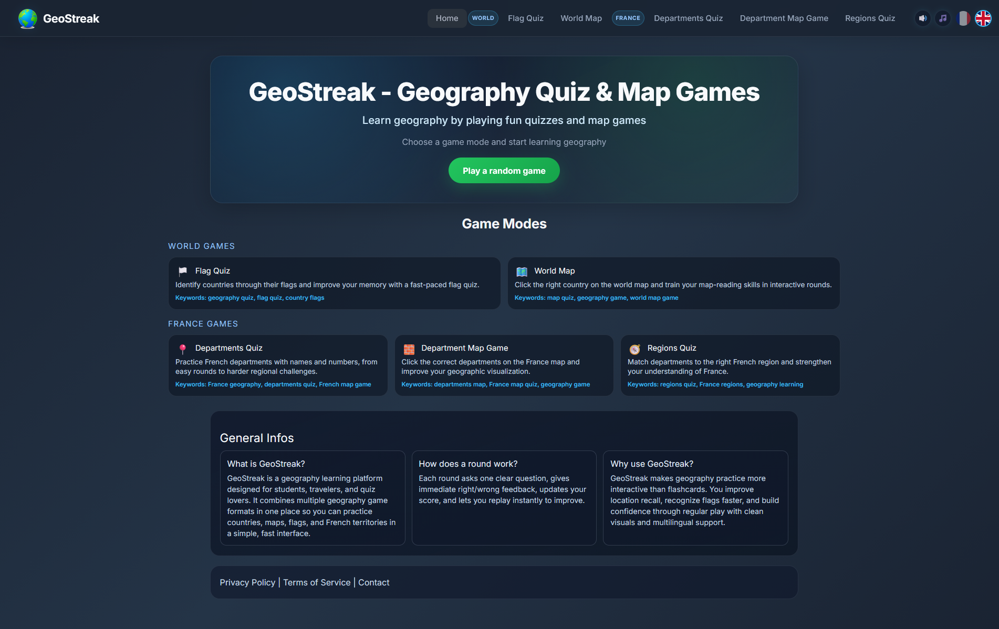
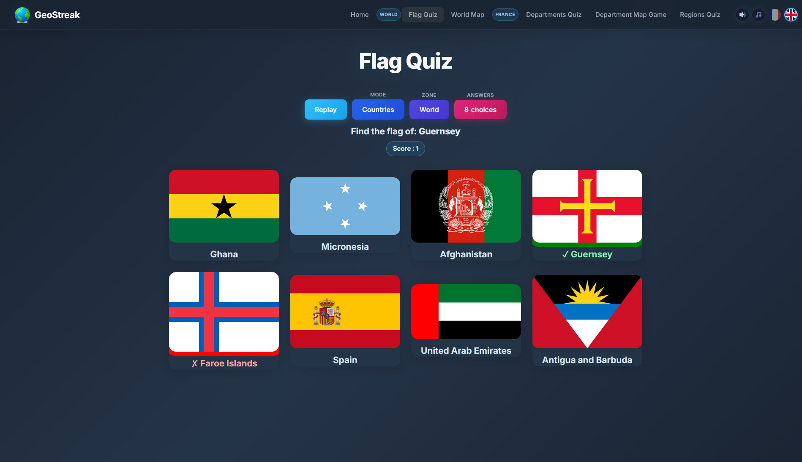
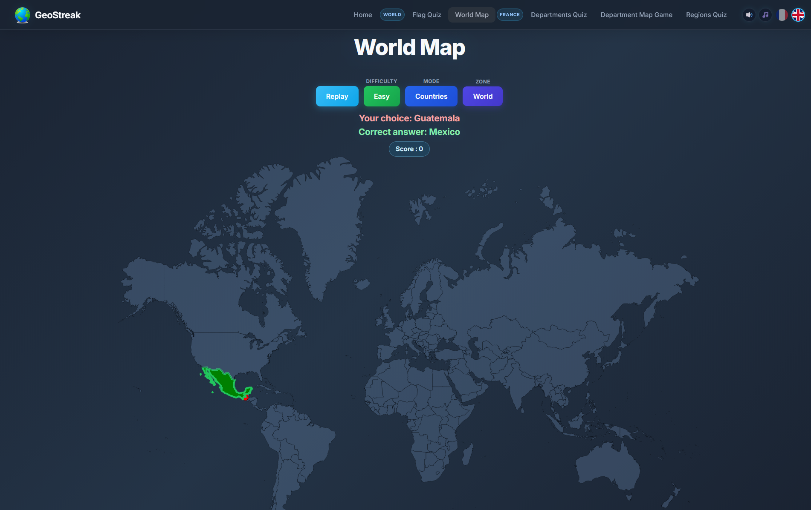
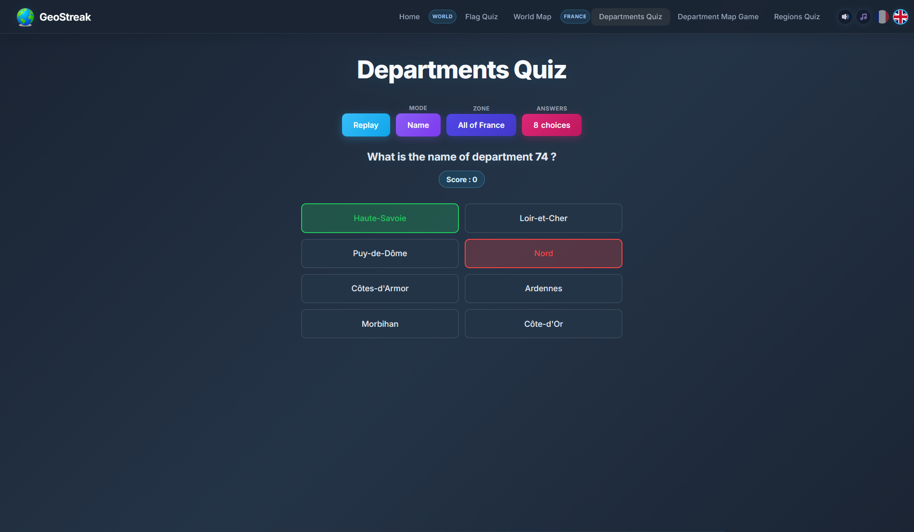
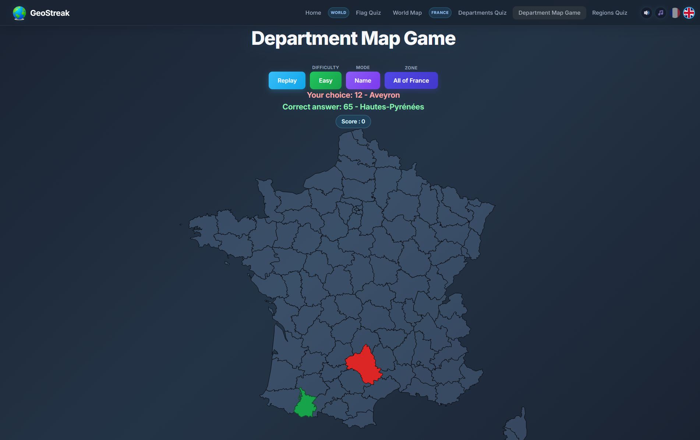
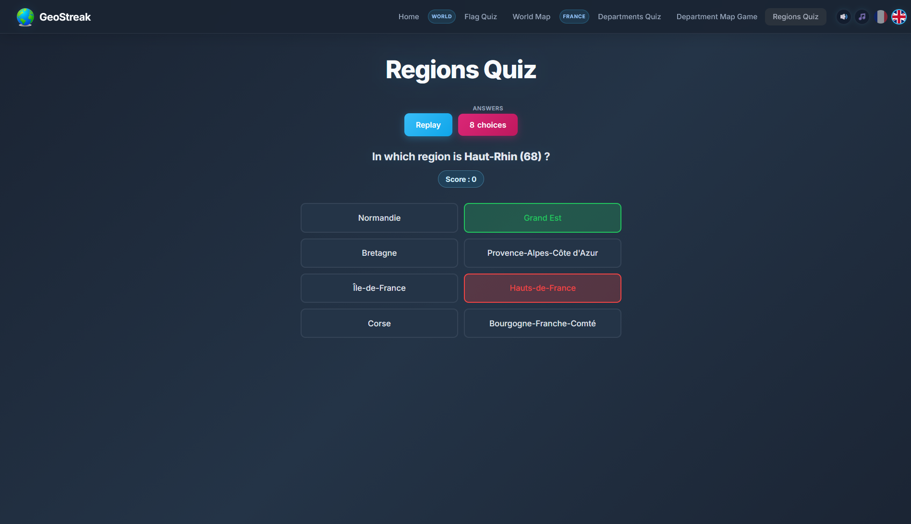
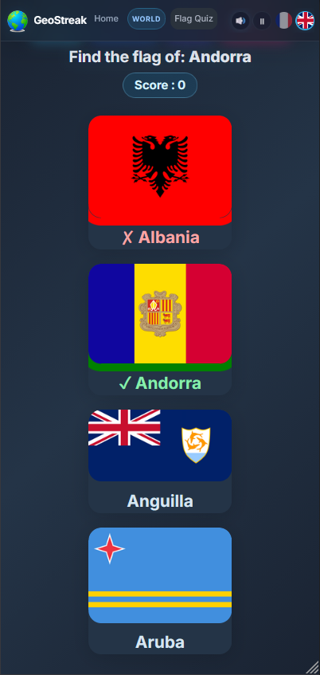

# GeoStreak

GeoStreak is an interactive geography learning platform that makes exploring the world fun and educational.

## Game Modes

- Flag quiz
- World map quiz
- French departments quiz
- French departments map quiz
- French regions quiz

## Features

- French and English interface
- Zone filters (world and continents)
- Multiple answer counts (2, 4, 8 depending on mode)
- Easy/Hard difficulty on map games
- Immediate score feedback

### Preview

#### Start Screen

Use the home page to get a quick look around before launching a game.

#### World Games

World mode includes:
- Flag quiz
- World map quiz

| Flag Game | World Map Game |
| --- | --- |
|  |  |

#### France Games

France mode includes:
- French departments quiz
- French departments map quiz
- French regions quiz

| Departments Game | Department Map Game | Regions Game |
| --- | --- | --- |
|  |  |  |

### Play Anywhere

GeoStreak is responsive and works on desktop, tablet, and phone, so you can train geography anywhere.

## Run Locally

1. Clone or download this repository.
2. Open `index.html` in a modern browser.
3. Play directly, no build step required.
4. Or play directly on the website: https://geo-streak.vercel.app

## License

Personal project - all rights reserved.